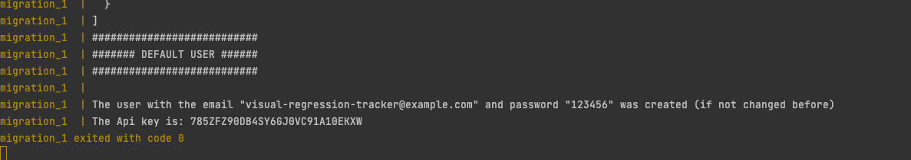
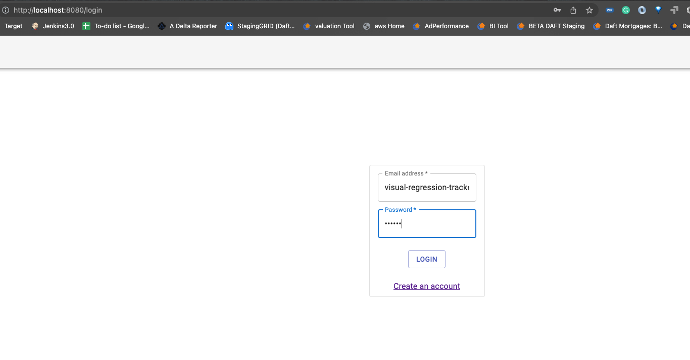

1) Install all packages for app-demo

<code>cd app_demo</code>
<code>npm install</code>

2) Run the React app from package.json scripts <code>"start":</code> or from terminal <code>npm start</code>
   http://localhost:3000/

4) Run the Docker Compose file for Visual Regression Tracker.  
   <code>cd visual-regression-tracker</code>
   <code>docker compose up</code>

5) Change VisualRegressionTools.ts to have the correct Api and project.
http://localhost:8080/login

http://localhost:8080/profile

6) Start delta reporter from the docker compose file.
   From terminal
   <code>cd delta-reporter</code>

   <code>docker compose up</code>
   http://localhost:4000/
